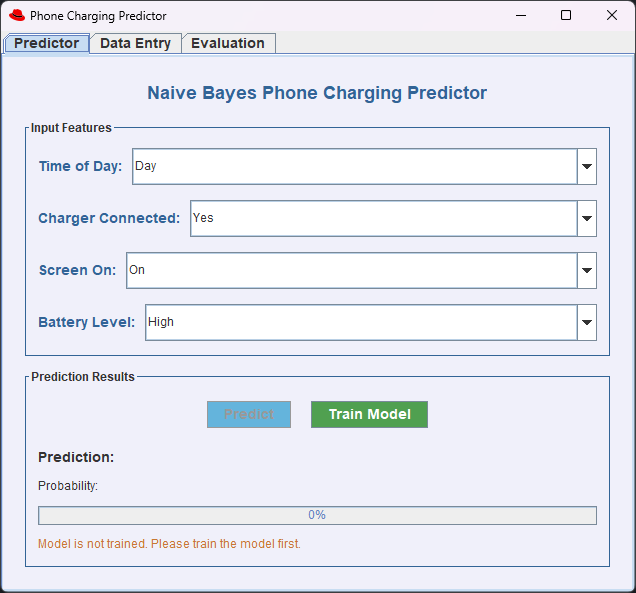
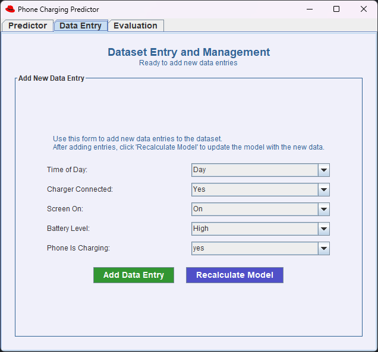
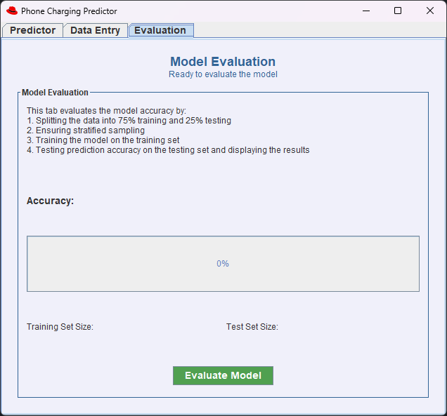

# Naive Bayes Phone Charging Predictor - Ryan Pitman C23741429

## Project Overview
This application is a Naive Bayes GUI predictor that allows users to predict if a phone is charging based on a predetermined dataset. The application successfully implements the Naive Bayes classifier algorithm to analyze phone charging patterns based on specific features: time of day, charger connection status, screen status, and battery level.

The dataset used to train the predictor was generated using ChatGPT 4o.

Throughout the project, I utilised Javadoc practices to document every method in the program. I wanted to get practice with docstrings, and utilise them more in my code.

## Frequency Table for the Dataset
The frequency table shows the counts for different feature combinations in the dataset:

| Feature | Value | Phone Charging = yes | Phone Charging = no |
|---------|-------|----------------------|---------------------|
| TimeOfDay | Day | 27 | 69 |
| TimeOfDay | Night | 40 | 65 |
| ChargerConnected | Yes | 40 | 53 |
| ChargerConnected | No | 27 | 81 |
| ScreenOn | On | 33 | 51 |
| ScreenOn | Off | 34 | 83 |
| BatteryLevel | High | 26 | 90 |
| BatteryLevel | Low | 41 | 44 |

Total count: 201 data instances
- Label "yes" (phone is charging): 67 instances
- Label "no" (phone is not charging): 134 instances

## Project GUI

The application features a user-friendly GUI with three main tabs:

### Predictor Tab

*The Predictor tab allows users to select their feature values and get predictions on whether the phone is charging or not.*

### Data Entry Tab

*The Data Entry tab enables users to add new data instances to the original training dataset.*

### Evaluation Tab

*The Evaluation tab allows users to assess the classifier's performance using a stratified train-test splits.*

## Java Classes

Each class is seperated into packages, as I found it simpler to keep as much functionality spread across different files as possible.
Throughout the project, I tried to stick to Java convention as much as possible, to follow best practices.

### Main Package: com.week12.assignment

#### 1. Main.java
   - The entry point of the application that initializes the classifier, loads the dataset, and then launches the GUI.

### Model Package: com.week12.assignment.model

#### 2. NaiveBayes.java
   - Implements the Naive Bayes classifier algorithm with methods for training, prediction, and evaluation.
   - Later on I implemented Laplace smoothing, which is common in Naive Bayes implementations to improve my models accuracy.

#### 3. DataInstance.java
   - Represents a single data instance with four features (TimeOfDay, ChargerConnected, ScreenOn, BatteryLevel) and a class label (PhoneIsCharging).
   - I designed this class to make it easy to manipulate and process the data across the application.

#### 4. FrequencyTable.java
   - Stores and manages the frequency counts of features in the dataset, which are used by the Naive Bayes algorithm to calculate probabilities.
   - This class uses a HashMap implementation to efficiently store and retrieve frequency data.

### GUI Package: com.week12.assignment.gui

#### 5. PredictorGUI.java
   - The main GUI window with tabbed panels for prediction, data entry, and evaluation functions.
   - I used Java Swing to create a clean and intuitive interface for users to interact with the predictor.

#### 6. DataEntryPanel.java
   - Allows users to add new data instances to the dataset and save them to the CSV file.
   - This panel provides a simple form for entering new data points to expand the training set.

#### 7. EvaluationPanel.java
   - Provides functionality to evaluate the classifier using stratified train-test splits and then visualizes the results.
   - I chose to stratify the data with as much of an even mix as possible of yes and no permutations, and decided on a 75% train and 25% test split.

### Utils Package: com.week12.assignment.utils

#### 8. CSVReader.java
   - Handles loading and parsing the CSV dataset file, this class utilises an inputStream and BufferedReader to load the data into DataInstances

### Data Package: com.week12.assignment.data

#### 9. charging_dataset.csv
   - Contains the dataset with 201 instances of phone charging data.
   - This dataset was carefully crafted to provide meaningful patterns for the Naive Bayes algorithm to learn from.

## Functionality Included

1. **Prediction**
   - Predict whether a phone is charging based on input features
   - Display prediction results with probabilities
   - Visual representation of prediction confidence using progress bars

2. **Model Training**
   - Train the Naive Bayes classifier on the dataset
   - Display training status and completion message
   - Option to retrain after adding new data

3. **Data Management**
   - Add new data instances to the dataset through a user-friendly form
   - Save updated dataset to the CSV file for future use

4. **Model Evaluation**
   - Evaluate classifier accuracy with different train-test splits
   - Display evaluation metrics and results in real-time using a simple interface

5. **User Interface**
   - Clean, intuitive GUI with tabbed organization for better user experience
   - User-friendly input controls (dropdown menus) across all features
   - Color-coded results for better understanding of predictions and accuracy, consistent throughout the program

## Pain Points

When creating this assignment, I ran into several struggles and issues along the way. These are the notable ones:

1. **Data Input**
    - When taking the CSV as input, I originally had to change to a buffered reader and then an input stream
    - This is due to how my paths were working, as well as how to maintain the CSV file for appending later on

2. **Laplace smoothing**
    - Originally the model had terrible accuracy (50%), which showed a flaw in the implementation or dataset
    - To combat this, I implemented Laplace smoothing, which increased the accuracy of the model, but not enough at the time

3. **Dataset issues**
    - I realised that my dataset was not realistic for the use case of a Naive Bayes algorithm.
    - Naive Bayes utilises patterns and probabilties to make its predictions, and my dataset was originally completely random
    - Without meaningful patterns, my model was stuck at 50% accuracy. Changing the dataset to one that followed patterns allowed me to achieve up to 80%.

## Future Improvements

If I had more time, I would add the following features:

1. **Alternative Algorithms**
   - Implement other classification algorithms such as Decision Trees or Random Forests
   - This could allow comparison between different algorithms for the same dataset, leading to interesting results

2. **Enhanced Visualization**
   - Add more charts and graphs for data exploration and pattern discovery
   - This would allow a deeper understanding of the dataset

3. **Export/Import Functionality**
   - Save and load trained models to avoid retraining
   - This could allow multiple datasets to be used for training, and allow a quicker user experience